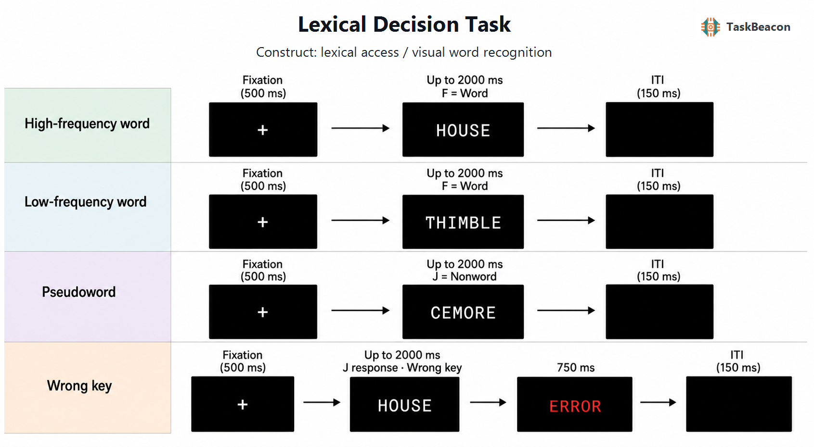

# Lexical Decision Task

| Field | Value |
|---|---|
| Name | Lexical Decision Task |
| Task ID | `T000062` |
| Variant | Visual single-string word/nonword decision |
| Version | `v0.1.0` |
| Date Updated | 2026-07-12 |
| PsyFlow Version | `0.2.0` |
| PsychoPy Version | `2025.1.1` |
| Modality | Behavioral |
| Language | Chinese instructions; English stimuli |
| Primary construct | Lexical access and visual word recognition |
| Release | `v0.1.0` |

## 1. Task Overview

Participants classify each uppercase English letter string as a word (`F`) or nonword (`J`). The scored design separates high-frequency words, low-frequency words, and pronounceable pseudowords to estimate lexicality and word-frequency effects. Ratcliff, Gomez, and McKoon (2004) provide the primary single-string protocol; the English Lexicon Project supplies large-scale validation, and Meyer and Schvaneveldt (1971) provide historical provenance.

The release contains 30 high-frequency words, 30 low-frequency words, and 60 pseudowords. All scored items are unique, pseudoword donors are never presented, and practice items are disjoint from scored items.

## 2. Task Flow



### Block-Level Flow

1. Chinese instructions explain the English word/nonword decision.
2. One 30-trial practice block is excluded from analysis.
3. Four scored blocks contain 30 trials each and self-paced breaks.
4. Every scored block contains 15 words and 15 pseudowords.
5. High/low counts alternate 8/7 and 7/8, yielding 30 of each word class overall.
6. Final feedback reports accuracy, lexicality accuracy, timeouts, and the low-minus-high median RT effect.

### Trial-Level Flow

| Phase | Duration | Participant-facing event |
|---|---:|---|
| Fixation | 500 ms | Central white plus |
| Lexical decision | Up to 2000 ms | Uppercase string; F = word, J = nonword |
| Error feedback | 750 ms | Red error message after a wrong key only |
| ITI | 150 ms | Blank black display |

### Controller Logic

The task is nonadaptive and has no custom controller. PsyFlow owns trial identity, phase timing, response capture, triggers, context, and persistence.

### Other Logic

`generate_trial_blocks()` validates the CSV pool, enforces donor/display disjointness, allocates every scored item once, balances lexicality and word frequency, and shuffles with stable independent seeds.

## 3. Configuration Summary

### a. Subject Info

| Parameter | Value |
|---|---|
| Subject ID | Three digits |
| Word response | F |
| Nonword response | J |

### b. Window Settings

| Parameter | Value |
|---|---|
| Window | 1280 x 800 px |
| Units | Visual degrees |
| Background | Black |
| Viewing distance | 60 cm configured |

### c. Stimuli

| Stimulus | Definition |
|---|---|
| High-frequency word | Zipf 5.24-6.29 in `wordfreq` 3.1.1 |
| Low-frequency word | Zipf 2.22-3.85, recognizable dictionary word |
| Pseudoword | Held-out donor with all vowels replaced; Zipf 0 |
| Display | Centered uppercase monospace white text |
| Error feedback | Red Chinese equivalent of ERROR |

The full pool is [assets/stimuli.csv](assets/stimuli.csv).

### d. Timing

| Parameter | Value |
|---|---:|
| Fixation | 500 ms |
| Response deadline | 2000 ms |
| Error feedback | 750 ms |
| ITI | 150 ms |

### e. Triggers

| Event | Code |
|---|---:|
| Experiment start/end | 1 / 99 |
| Block start/end | 10 / 90 |
| Fixation | 20 |
| High/low/pseudoword onset | 30 / 31 / 32 |
| Practice word/nonword onset | 33 / 34 |
| Word/nonword response/timeout | 40 / 41 / 42 |
| Error feedback / ITI | 50 / 60 |

Run locally with:

```powershell
python main.py human
python main.py qa --config config/config_qa.yaml
python main.py sim --config config/config_scripted_sim.yaml
python main.py sim --config config/config_sampler_sim.yaml
```

QA uses runtime timing scaling while preserving canonical values. Simulation profiles use explicit 1:10 timing because they test state and response semantics rather than psychophysical latency.

## 4. Methods (for academic publication)

Participants completed a visual lexical decision task implemented in PsychoPy and PsyFlow. After a 500 ms fixation, a single uppercase English letter string appeared centrally until response or for a maximum of 2000 ms. Participants pressed F for English words and J for nonwords. Incorrect keyed responses were followed by a 750 ms error message, and trials ended with a 150 ms blank interval. A 30-trial practice block preceded four scored blocks of 30 trials. Each scored block contained 15 words and 15 pronounceable pseudowords; high- and low-frequency word counts alternated 8/7 across blocks. Primary outcomes were accuracy, median correct RT by condition, and the low-frequency-minus-high-frequency RT effect.

The 30-trial block structure, equal word/nonword ratio, practice block, error-feedback duration, ITI, and vowel-replacement pseudoword method follow Ratcliff et al. (2004). Four scored blocks replace the source experiment's 50 blocks; the reported 2000 ms upper RT analysis cutoff is used as the response deadline; F/J replace `/`/`z`; and fixation duration and uppercase display are documented inferred details.

## References

- Ratcliff, R., Gomez, P., & McKoon, G. (2004). A diffusion model account of the lexical decision task. *Psychological Review, 111*(1), 159-182. https://doi.org/10.1037/0033-295X.111.1.159
- Balota, D. A., et al. (2007). The English Lexicon Project. *Behavior Research Methods, 39*(3), 445-459. https://doi.org/10.3758/BF03193014
- Meyer, D. E., & Schvaneveldt, R. W. (1971). Facilitation in recognizing pairs of words. *Journal of Experimental Psychology, 90*(2), 227-234. https://doi.org/10.1037/h0031564
